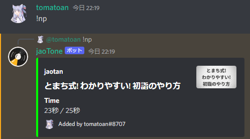
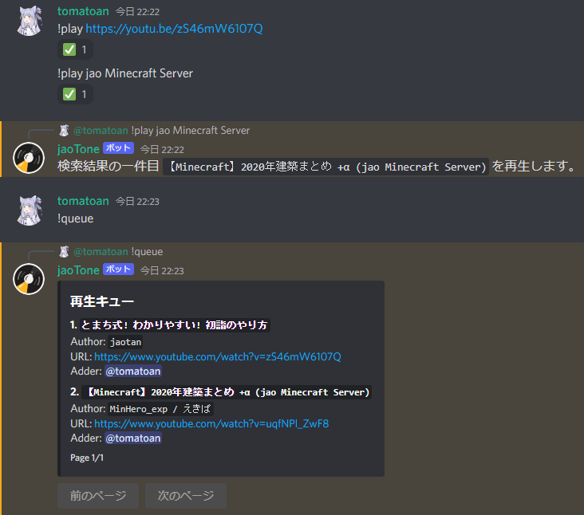

# jaoTone commands

プレフィックスは設定ファイルで変更されていない場合 `!` です。

- [clear](#clear)
- [disconnect](#disconnect)
- [nowplaying](#nowplaying)
- [pause](#pause)
- [play](#play)
- [queue](#queue)
- [repeat](#repeat)
- [resume](#resume)
- [shuffle](#shuffle)
- [skip](#skip)
- [summon](#summon)

## clear

キューをクリアします。再生中の曲も停止されます。

## disconnect

ボイスチャンネルから切断します。

- エイリアス: `leave`, `bye`

## nowplaying

再生中トラックの情報を表示します。

- エイリアス: `np`, `now`



## pause

再生を一時停止します。

## play

動画・音源 URL または指定された検索ワードの検索結果 1 件目をキューに追加します。

- エイリアス: `p`, `add`



## queue

現在の再生キューを表示します。

- エイリアス: `q`

## repeat

リピート設定を行います。

`single` で単一トラックリピート、`all` でキュー内リピート、`disable` でリピート設定の無効化を行えます。  
引数を指定しない場合は現在のリピート設定を表示します。

- エイリアス: `loop`

```text
!repeat
!repeat single
!repeat all
!repeat disable
```

## resume

再生を再開します。

## shuffle

再生キューをシャッフルします。

- エイリアス: `sh`, `resh`

## skip

再生中のトラックをスキップします。

- エイリアス: `s`

## summon

コマンド実行者が参加しているボイスチャンネルに参加します。
